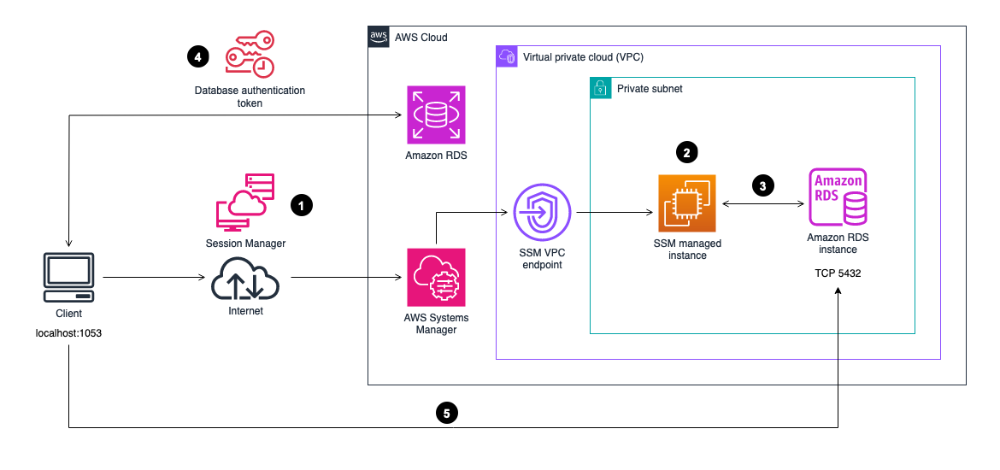

In order to connect to an RDS instance in a private subnet with EC2 bastion host that is also in a **private subnet**
(with a Security Group that does not allow any inbound traffic)


You can do the following:
1. Install AWS Session Manager Plugin for AWS CLI - [instruction](https://docs.aws.amazon.com/systems-manager/latest/userguide/session-manager-working-with-install-plugin.html)
2. Make sure the Bastion Host has:
   1. `AmazonSSMManagedInstanceCore` policy in the IAM Role (or appropriate `ssmmessages:`, `ssm:`, and `ec2messages:` privileges)
   2. Security Group with outbound allowing HTTPS communication with the RDS and SSM VPC endpoint interface (can alternatively allow all outbound to `0.0.0.0/0`)
3. Map the RDS port to the local one with:
    ```bash
    aws ssm start-session \
    --region <your region> \
    --target <your EC2 instance> \
    --document-name AWS-StartPortForwardingSessionToRemoteHost \
    --parameters '{"host":["'"<RDS-host>"'"],"portNumber":["<RDS-port>"],"localPortNumber":["<local-port>"]}'
    ```
4. Now you can connect to the database on the `localhost:local-port` without configuration of any additional tunneling.


See more [here](https://aws.amazon.com/blogs/database/securely-connect-to-amazon-rds-for-postgresql-with-aws-session-manager-and-iam-authentication/).